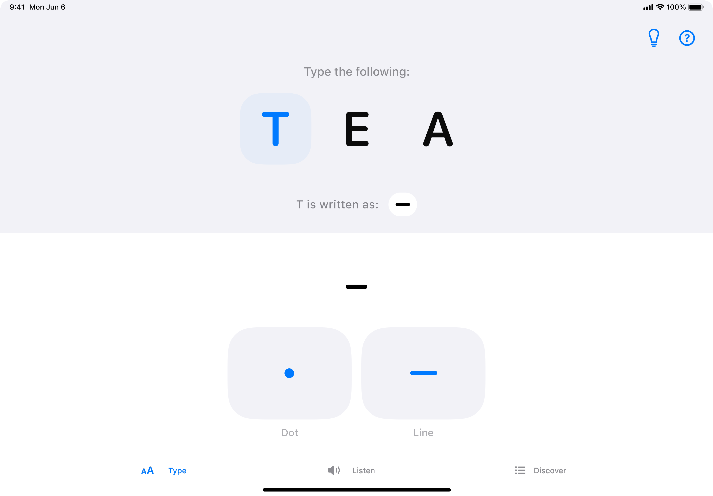

# Learn Morse

**Learn Morse** is an app for learning Morse in a joyful and intuitive way. It uses the power of SwiftUI to ensure fast learning in a playful manner. I tried to focus on animations and interactions to make it as fluid as possible.

*Morse code is a method used in communication to encode text characters as sequences of two different signals, called dots and dashes. It can be memorised and sent using sound, light and taptics.*

### Swift Student Challenge

This app was developed for the WWDC23 Swift Student Challenge and won. Ty Apple for the opportunity 👏

## Overview

There are three main tabs:

### Type

Using a designated keyboard, type the characters on the screen using Morse (dots and dashes only). This is useful to learn how to send messages.

### Listen 

Carefully listen to the signal played and choose the character corresponding to it. The difficulty increases as you play. The most difficult characters are at the end. Listening is the most intuitive way to learn how to receive a Morse code.

### Discover 

Explore a larger collection of Morse code symbols, including those not included in the quizzes.

## Technologies

The playground uses SwiftUI and AVKit.

## App Store

An App Store version of the app is planned.
